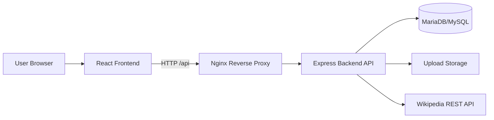
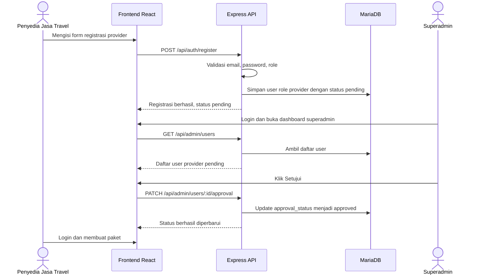
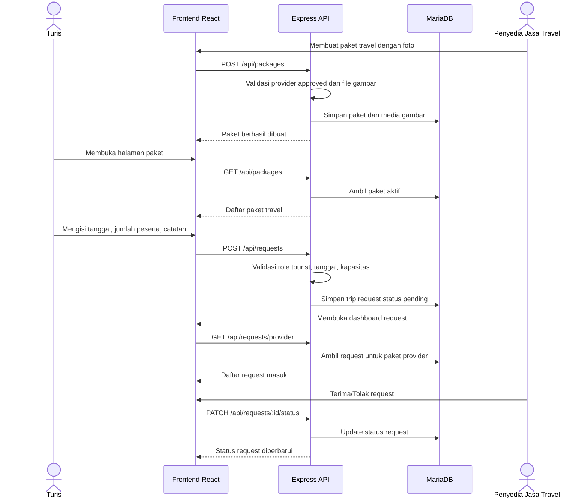
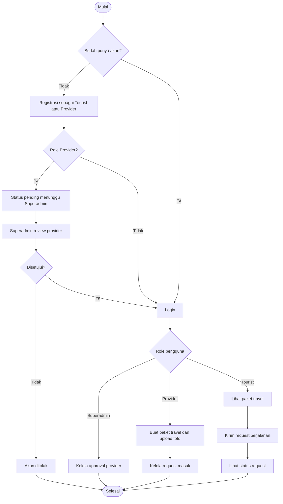
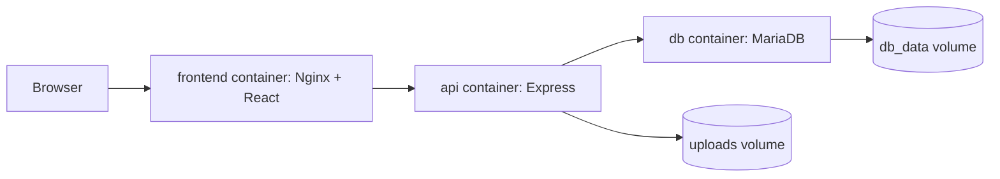

# Laporan Tugas 2 II2210 Teknologi Platform

## HiddenGem Explorer: Platform Katalog Destinasi dan Request Perjalanan

**Nama:** [ISI NAMA ANDA]  
**NIM:** [ISI NIM ANDA]  
**Kelas:** [ISI KELAS]  
**Tanggal:** [ISI TANGGAL PENGUMPULAN]  
**Repository:** https://github.com/oxanovijk/Tugas-1-Tekplat  
**Link platform publik:** https://hiddengem.stei.my.id  

---

## Catatan Pengisian Screenshot

Gunakan placeholder gambar di dokumen ini sebagai titik peletakan screenshot. Setelah ditempel di Google Docs, ganti teks placeholder dengan gambar asli dan beri caption seperti yang sudah disediakan.

Jika screenshot diambil dari terminal VM, pastikan bagian command dan output terlihat dalam satu gambar. Jika screenshot diambil dari browser, pastikan URL public atau URL lokal yang sedang diuji terlihat di address bar.

---

# BAB I Pendahuluan

## 1.1 Latar Belakang

Berdasarkan spesifikasi Tugas 2 II2210, platform tidak hanya perlu dapat diakses secara publik, tetapi juga harus memiliki alur interaksi yang jelas antara beberapa role pengguna. Pada Bab I 1.1 halaman 5, dokumen tugas menyatakan bahwa fokus tugas adalah memperluas platform sebelumnya dengan autentikasi, kontrol akses, backend, database mandiri, dan fungsi utama yang mendukung pertukaran layanan atau data antara produsen dan konsumen.

Pada Tugas 2 ini, HiddenGem Explorer dikembangkan dari katalog destinasi wisata menjadi platform interaksi antara penyedia jasa travel dan turis. Platform ini memungkinkan penyedia jasa travel menawarkan paket perjalanan ke destinasi tertentu, sedangkan turis dapat mengajukan request perjalanan tanpa melibatkan payment gateway. Superadmin berperan sebagai pengelola akses yang menyetujui akun penyedia jasa travel sebelum penyedia dapat membuat paket.

## 1.2 Tema dan Konsep Platform

Tema yang dipilih adalah **Tourism & Culture Exchange**. Berdasarkan Bab I 1.2 halaman 6, tema ini berfokus pada promosi potensi wisata tersembunyi dan pertukaran budaya di pelosok Indonesia, dengan menghubungkan narasi sejarah, budaya lokal, dan akses transportasi melalui integrasi API.

Konsep platform yang dikembangkan adalah:

- **Turis** dapat melihat destinasi dan paket travel.
- **Penyedia jasa travel** dapat membuat paket perjalanan untuk destinasi tertentu.
- **Turis** dapat mengirim request/minat perjalanan ke paket yang tersedia.
- **Penyedia jasa travel** dapat menerima, menolak, atau menyelesaikan request.
- **Superadmin** dapat menyetujui atau menolak registrasi penyedia jasa travel.

Konsep ini dipilih agar interaksi produsen-konsumen tetap jelas tanpa harus membuat sistem pembayaran. Dalam platform ini, produsen adalah penyedia jasa travel, sedangkan konsumen adalah turis.

## 1.3 Tujuan Pengembangan

Tujuan pengembangan HiddenGem Explorer pada Tugas 2 adalah:

1. Menambahkan sistem autentikasi dan kontrol akses berbasis role.
2. Menyediakan backend server untuk mengelola logika aplikasi.
3. Menyimpan data pengguna, destinasi, paket travel, media gambar, dan request perjalanan pada database mandiri di VPS.
4. Menambahkan integrasi API eksternal/publik.
5. Menyediakan platform yang dapat diakses secara online/public.

Tujuan tersebut mengacu pada Bab I 1.3 halaman 6 yang mensyaratkan frontend, backend/server, database mandiri pada server/VPS, minimal satu API eksternal/publik, dan akses publik melalui internet.

[PLACEHOLDER GAMBAR 1 - Tampilan Home Public Platform]  
**Cara mengambil screenshot:** Buka `https://hiddengem.stei.my.id` di browser. Pastikan address bar dan tampilan utama HiddenGem Explorer terlihat.  
**Caption:** Gambar 1. Tampilan awal platform HiddenGem Explorer yang dapat diakses secara publik.

---

# BAB II Analisis Kebutuhan dan Kesesuaian Spesifikasi

## 2.1 Ringkasan Spesifikasi Tugas

Berdasarkan Bab I 1.3 halaman 6, platform minimal harus mencakup lima aspek:

1. Frontend aplikasi yang dapat diakses pengguna.
2. Backend atau layanan server untuk mengelola logika aplikasi.
3. Database yang dikelola sendiri pada server/VPS.
4. Integrasi minimal satu API eksternal/publik.
5. Platform dapat diakses secara online/public melalui internet.

Implementasi HiddenGem Explorer memenuhi spesifikasi tersebut sebagai berikut:

| Aspek Spesifikasi | Implementasi pada HiddenGem Explorer |
| --- | --- |
| Frontend | React + TypeScript + Vite |
| Backend/server | Express.js API pada folder `api/` |
| Database mandiri | MariaDB/MySQL self-managed di VM/aaPanel |
| API eksternal/publik | Wikipedia REST API melalui endpoint `/api/external/wiki-summary` |
| Akses publik | Domain `https://hiddengem.stei.my.id` |

## 2.2 Role Pengguna

Berdasarkan Bab II 2.1 halaman 8, platform minimal harus memiliki tiga jenis pengguna, yaitu superadmin, produsen, dan konsumen. Pada tema Tourism & Culture Exchange, dokumen tugas memberi contoh role produsen sebagai **Penyedia Jasa Travel** dan konsumen sebagai **Turis**.

Role yang digunakan pada HiddenGem Explorer adalah:

| Role | Padanan Spesifikasi | Fungsi Utama |
| --- | --- | --- |
| Superadmin | Superadmin | Menyetujui atau menolak akun penyedia travel |
| Provider | Produsen/Penyedia Jasa Travel | Membuat paket perjalanan dan mengelola request turis |
| Tourist | Konsumen/Turis | Melihat paket dan mengirim request perjalanan |

## 2.3 Autentikasi dan Kontrol Akses

Sistem autentikasi menggunakan registrasi dan login berbasis email-password. Password disimpan dalam bentuk hash menggunakan `bcrypt`, sedangkan sesi pengguna dikelola menggunakan JSON Web Token (JWT).

Aturan akses yang diterapkan:

1. Turis dapat langsung menggunakan akun setelah registrasi.
2. Provider baru berstatus `pending` setelah registrasi.
3. Provider baru dapat membuat paket setelah disetujui oleh superadmin.
4. Superadmin dapat melihat daftar pengguna dan mengubah status approval provider.
5. Endpoint tertentu hanya dapat diakses oleh role yang sesuai.

Pola ini dipilih karena sesuai dengan Bab II 2.1 halaman 8 yang meminta registrasi pengguna hanya diterima ketika pengguna diterima oleh superadmin, setidaknya untuk salah satu role agar alur tetap sederhana.

[PLACEHOLDER GAMBAR 2 - Halaman Login/Register]  
**Cara mengambil screenshot:** Buka platform, klik menu `Daftar` atau `Masuk`. Ambil screenshot saat form login/register terlihat.  
**Caption:** Gambar 2. Form login dan registrasi pengguna.

[PLACEHOLDER GAMBAR 3 - Dashboard Superadmin Approval Provider]  
**Cara mengambil screenshot:** Login sebagai superadmin. Buka dashboard superadmin. Jika belum ada provider pending, register akun provider baru terlebih dahulu. Ambil screenshot daftar user dan tombol `Setujui/Tolak`.  
**Caption:** Gambar 3. Dashboard superadmin untuk approval akun penyedia travel.

---

# BAB III Arsitektur Sistem

## 3.1 Arsitektur Umum

Arsitektur HiddenGem Explorer terdiri dari tiga lapisan utama: frontend, backend, dan database. Frontend berjalan sebagai aplikasi React, backend berjalan sebagai Express API, dan database menggunakan MariaDB/MySQL yang dikelola mandiri pada server/VPS.

Arsitektur ini dipilih karena sesuai dengan Bab I 1.1 halaman 5 yang menyebutkan bahwa platform harus memiliki lapisan data, lapisan layanan, dan antarmuka pengguna yang saling terhubung. Selain itu, Bab II 2.2 halaman 8 menyatakan bahwa arsitektur database dan backend dibebaskan selama database dikelola mandiri dan dapat menyimpan data selain teks.



[PLACEHOLDER GAMBAR 4 - Diagram Arsitektur Sistem]  
**Cara mengambil screenshot/gambar:** Render diagram Mermaid di atas menggunakan Mermaid Live Editor atau gambar ulang di Google Docs dengan shape. Pastikan komponen Browser, React, Nginx, Express API, Database, Upload Storage, dan Wikipedia API terlihat.  
**Caption:** Gambar 4. Arsitektur umum HiddenGem Explorer.

## 3.2 Komponen Teknologi

| Komponen | Teknologi | Alasan Pemilihan |
| --- | --- | --- |
| Frontend | React + TypeScript + Vite | Cocok untuk UI interaktif, type safety, dan build statis |
| Backend | Node.js + Express | Routing API sederhana, modular, dan mudah di-deploy |
| Database | MariaDB/MySQL | Dapat dikelola mandiri di VPS/aaPanel |
| File upload | Multer | Mendukung upload `multipart/form-data` untuk gambar paket |
| Reverse proxy | Nginx | Meneruskan request `/api` dari frontend ke backend |
| Process manager | PM2 | Menjaga backend tetap berjalan di server |
| Optional bonus | Docker Compose | Menyatukan frontend, backend, dan database dalam container |

## 3.3 Struktur Repository

Struktur repository utama:

```text
.
├── api/
│   ├── schema.sql
│   ├── seed.sql
│   └── src/
│       ├── routes/
│       ├── middleware/
│       ├── config/
│       └── server.ts
├── docs/
│   ├── TUGAS2_IMPLEMENTATION_PLAN.md
│   ├── TUGAS2_DEPLOYMENT_GUIDE.md
│   └── TUGAS2_LAPORAN_DRAFT.md
├── src/
│   ├── api/
│   ├── data/
│   ├── App.tsx
│   └── App.css
├── Dockerfile
├── docker-compose.yml
└── README.md
```

[PLACEHOLDER GAMBAR 5 - Repository GitHub]  
**Cara mengambil screenshot:** Buka repository GitHub `https://github.com/oxanovijk/Tugas-1-Tekplat`. Ambil screenshot yang memperlihatkan folder `api`, `src`, `docs`, dan file Docker.  
**Caption:** Gambar 5. Struktur repository HiddenGem Explorer di GitHub.

---

# BAB IV Database, Backend, dan Format Data

## 4.1 Database Mandiri

Berdasarkan Bab II 2.2 halaman 8, database wajib dikelola secara mandiri di VPS tanpa menggunakan layanan database eksternal seperti Supabase atau layanan serupa. Oleh karena itu, HiddenGem Explorer menggunakan MariaDB/MySQL yang dibuat melalui server/aaPanel.

Tabel utama yang digunakan:

| Tabel | Fungsi |
| --- | --- |
| `users` | Menyimpan akun, role, password hash, dan status approval |
| `destinations` | Menyimpan data destinasi wisata |
| `travel_packages` | Menyimpan paket perjalanan yang dibuat provider |
| `package_media` | Menyimpan metadata file gambar dan blob gambar |
| `trip_requests` | Menyimpan request perjalanan dari turis |

## 4.2 Penyimpanan Data Selain Teks

Bab II 2.2 halaman 8-9 meminta backend/database dapat menyimpan data selain teks seperti gambar, video, gif, atau serupa. Pada implementasi ini, data selain teks diwujudkan melalui foto paket perjalanan.

Foto paket disimpan dalam dua bentuk:

1. File fisik di folder upload server.
2. Metadata dan `image_blob` pada tabel `package_media`.

Pendekatan ini dipilih agar file dapat ditampilkan cepat melalui URL `/uploads`, sementara database tetap memiliki bukti penyimpanan data non-teks.

[PLACEHOLDER GAMBAR 6 - Import Database Schema]  
**Cara mengambil screenshot:** Di VM, jalankan:

```bash
mysql -u hiddengem_user -p hiddengem_db < api/schema.sql
mysql -u hiddengem_user -p hiddengem_db < api/seed.sql
```

Ambil screenshot terminal setelah command selesai tanpa error.  
**Caption:** Gambar 6. Import schema dan seed database MariaDB.

[PLACEHOLDER GAMBAR 7 - Tabel Database di aaPanel/phpMyAdmin]  
**Cara mengambil screenshot:** Buka aaPanel atau phpMyAdmin, masuk ke database `hiddengem_db`, tampilkan daftar tabel `users`, `destinations`, `travel_packages`, `package_media`, dan `trip_requests`.  
**Caption:** Gambar 7. Tabel database HiddenGem Explorer.

## 4.3 Backend API

Backend Express menyediakan endpoint utama berikut:

| Endpoint | Method | Role | Fungsi |
| --- | --- | --- | --- |
| `/api/auth/register` | POST | Public | Registrasi tourist/provider |
| `/api/auth/login` | POST | Public | Login dan mendapatkan JWT |
| `/api/auth/me` | GET | Authenticated | Mengambil data user aktif |
| `/api/admin/users` | GET | Superadmin | Melihat daftar user |
| `/api/admin/users/:id/approval` | PATCH | Superadmin | Mengubah status approval provider |
| `/api/destinations` | GET | Public | Mengambil daftar destinasi |
| `/api/packages` | GET | Public | Mengambil paket travel aktif |
| `/api/packages` | POST | Provider approved | Membuat paket travel dan upload foto |
| `/api/packages/mine` | GET | Provider | Melihat paket milik provider |
| `/api/requests` | POST | Tourist | Membuat request perjalanan |
| `/api/requests/tourist` | GET | Tourist | Melihat request milik tourist |
| `/api/requests/provider` | GET | Provider | Melihat request yang masuk ke paket provider |
| `/api/requests/:id/status` | PATCH | Provider | Mengubah status request |
| `/api/external/wiki-summary` | GET | Public | Mengambil ringkasan destinasi dari Wikipedia API |

[PLACEHOLDER GAMBAR 8 - Backend Health Check]  
**Cara mengambil screenshot:** Di VM, jalankan:

```bash
curl http://127.0.0.1:3001/api/health
```

Atau buka `https://hiddengem.stei.my.id/api/health` di browser. Pastikan output `{"status":"ok","service":"hiddengem-api"}` terlihat.  
**Caption:** Gambar 8. Health check backend API.

[PLACEHOLDER GAMBAR 9 - PM2 Status Backend]  
**Cara mengambil screenshot:** Di VM, jalankan:

```bash
pm2 status
```

Ambil screenshot yang memperlihatkan proses `hiddengem-api` berstatus online.  
**Caption:** Gambar 9. Backend Express berjalan menggunakan PM2.

---

# BAB V Alur Interaksi Produsen dan Konsumen

Berdasarkan Bab II 2.3 halaman 9, platform harus memiliki alur interaksi antara produsen dan konsumen yang jelas. Setidaknya harus ada dua alur interaksi utama dan masing-masing divisualisasikan dengan sequence diagram. Alur harus mencakup aktor, pertukaran data/layanan/sumber daya, validasi, dan keluaran.

## 5.1 Alur Interaksi 1: Registrasi dan Approval Provider

Alur ini menjelaskan bagaimana penyedia jasa travel mendaftar sebagai produsen, lalu superadmin memvalidasi akun tersebut. Provider hanya dapat membuat paket setelah statusnya disetujui.



**Validasi yang dilakukan:**

- Email tidak boleh sudah terdaftar.
- Password minimal 8 karakter.
- Role registrasi hanya boleh `provider` atau `tourist`.
- Hanya superadmin yang dapat mengubah status approval provider.
- Provider harus berstatus `approved` sebelum membuat paket.

**Keluaran alur:**

- Akun provider tersimpan di database.
- Status provider berubah dari `pending` menjadi `approved`.
- Provider dapat mengakses fitur pembuatan paket.

[PLACEHOLDER GAMBAR 10 - Sequence Diagram Approval Provider]  
**Cara mengambil screenshot/gambar:** Render diagram Mermaid di atas ke gambar atau gambar ulang di Google Docs. Pastikan aktor Provider, Frontend, API, Database, dan Superadmin terlihat.  
**Caption:** Gambar 10. Sequence diagram registrasi dan approval provider.

## 5.2 Alur Interaksi 2: Tourist Mengirim Request Perjalanan

Alur ini menjelaskan interaksi utama antara produsen dan konsumen. Provider menawarkan paket travel, lalu tourist memilih paket dan mengirim request perjalanan.



**Validasi yang dilakukan:**

- Hanya provider approved yang dapat membuat paket.
- Paket wajib memiliki foto.
- Hanya tourist yang dapat membuat request perjalanan.
- Jumlah peserta tidak boleh melebihi kapasitas paket.
- Tanggal request menggunakan format valid.
- Provider hanya dapat mengubah status request untuk paket miliknya.

**Keluaran alur:**

- Paket travel dengan foto muncul di halaman paket.
- Request tourist tersimpan dengan status `pending`.
- Provider dapat mengubah status request menjadi `accepted`, `rejected`, atau `completed`.

[PLACEHOLDER GAMBAR 11 - Sequence Diagram Request Perjalanan]  
**Cara mengambil screenshot/gambar:** Render diagram Mermaid di atas ke gambar atau gambar ulang di Google Docs. Pastikan aktor Tourist dan Provider terlihat sebagai pihak konsumen-produsen.  
**Caption:** Gambar 11. Sequence diagram request perjalanan antara turis dan penyedia travel.

---

# BAB VI Fungsional Platform

Berdasarkan Bab II 2.4 halaman 10, fungsi utama platform harus mendukung alur interaksi pada Bab II 2.3, dapat diakses melalui antarmuka platform, dan dijelaskan menggunakan system flowchart serta tabel fungsi.

## 6.1 System Flowchart



[PLACEHOLDER GAMBAR 12 - System Flowchart]  
**Cara mengambil screenshot/gambar:** Render flowchart Mermaid di atas atau gambar ulang di Google Docs. Pastikan alur registrasi, approval, role check, paket, dan request terlihat.  
**Caption:** Gambar 12. System flowchart fungsi utama HiddenGem Explorer.

## 6.2 Tabel Fungsi Platform

| Nama Fungsi | Role | Input | Penjelasan | Validasi | Output |
| --- | --- | --- | --- | --- | --- |
| Registrasi akun | Tourist, Provider | Nama, email, password, role | Membuat akun baru | Email unik, password minimal 8 karakter, role valid | User baru tersimpan |
| Login | Semua role | Email, password | Mengautentikasi pengguna | Email-password cocok, akun tidak rejected | JWT dan data user |
| Approval provider | Superadmin | ID provider, status approval | Menyetujui/menolak provider | User harus superadmin, target harus provider | Status provider diperbarui |
| Lihat destinasi | Public | Query opsional | Menampilkan katalog destinasi | Data destinasi tersedia | Daftar destinasi |
| Buat paket travel | Provider approved | Destinasi, judul, deskripsi, durasi, harga, kapasitas, gambar | Provider menawarkan layanan perjalanan | Provider approved, destinasi valid, gambar valid | Paket dan gambar tersimpan |
| Lihat paket travel | Public | Query destinasi opsional | Menampilkan paket aktif | Paket berstatus active | Daftar paket |
| Buat trip request | Tourist | Paket, tanggal, jumlah peserta, catatan | Tourist mengajukan minat perjalanan | Role tourist, paket aktif, peserta tidak melebihi kapasitas | Request status pending |
| Lihat request tourist | Tourist | Token login | Tourist melihat request miliknya | Role tourist | Daftar request tourist |
| Lihat request provider | Provider | Token login | Provider melihat request untuk paketnya | Role provider | Daftar request masuk |
| Update status request | Provider | ID request, status baru | Provider menerima/menolak/menyelesaikan request | Request harus milik paket provider | Status request diperbarui |
| Ringkasan Wikipedia | Public | Judul destinasi | Mengambil informasi eksternal destinasi | Query title tersedia | Ringkasan dari Wikipedia API |

[PLACEHOLDER GAMBAR 13 - Dashboard Provider Membuat Paket]  
**Cara mengambil screenshot:** Login sebagai provider yang sudah approved. Buka dashboard provider. Isi form paket dengan foto. Ambil screenshot saat form dan daftar paket terlihat.  
**Caption:** Gambar 13. Dashboard provider untuk membuat paket travel.

[PLACEHOLDER GAMBAR 14 - Halaman Paket dengan Foto]  
**Cara mengambil screenshot:** Buka menu `Paket` setelah provider membuat paket. Pastikan foto, nama paket, destinasi, harga, durasi, dan tombol request terlihat.  
**Caption:** Gambar 14. Halaman paket travel dengan media gambar.

[PLACEHOLDER GAMBAR 15 - Dashboard Tourist Request Perjalanan]  
**Cara mengambil screenshot:** Login sebagai tourist. Buka halaman paket, klik request, isi tanggal dan jumlah peserta. Setelah request dibuat, buka dashboard tourist dan ambil screenshot daftar request.  
**Caption:** Gambar 15. Dashboard tourist yang menampilkan request perjalanan.

[PLACEHOLDER GAMBAR 16 - Dashboard Provider Request Masuk]  
**Cara mengambil screenshot:** Login kembali sebagai provider. Buka dashboard provider. Ambil screenshot daftar request masuk dan tombol Terima/Tolak/Selesai.  
**Caption:** Gambar 16. Dashboard provider untuk mengelola request dari tourist.

---

# BAB VII Integrasi API Eksternal

Berdasarkan Bab I 1.3 halaman 6, platform wajib mengintegrasikan minimal satu API eksternal/publik. HiddenGem Explorer menyediakan endpoint backend:

```text
GET /api/external/wiki-summary?title=<judul_destinasi>
```

Endpoint ini mengambil ringkasan destinasi dari Wikipedia REST API. Integrasi ini dipilih karena tema Tourism & Culture Exchange membutuhkan narasi sejarah, budaya, dan informasi destinasi. Wikipedia API digunakan sebagai sumber informasi eksternal yang dapat memperkaya konteks destinasi.

[PLACEHOLDER GAMBAR 17 - Tes API Eksternal]  
**Cara mengambil screenshot:** Buka browser atau terminal dan akses contoh:

```bash
curl "https://hiddengem.stei.my.id/api/external/wiki-summary?title=Kampung%20Naga"
```

Pastikan output JSON dari Wikipedia terlihat.  
**Caption:** Gambar 17. Integrasi API eksternal Wikipedia melalui backend.

---

# BAB VIII Deployment dan Akses Publik

## 8.1 Deployment Frontend dan Backend

Deployment dilakukan pada VM Ubuntu dengan aaPanel dan Nginx. Frontend React di-build menjadi file statis, sedangkan backend Express dijalankan sebagai service Node.js menggunakan PM2. Nginx digunakan sebagai reverse proxy agar endpoint `/api` pada domain publik diteruskan ke backend.

Struktur akses:

```text
https://hiddengem.stei.my.id          -> Frontend React
https://hiddengem.stei.my.id/api/...  -> Backend Express via Nginx reverse proxy
```

Pendekatan satu domain dengan path `/api` dipilih karena PDF Tugas 2 tidak mensyaratkan backend harus berada pada domain/website terpisah. Bab I 1.3 halaman 6 hanya mensyaratkan adanya backend atau layanan server, bukan pemisahan domain.

[PLACEHOLDER GAMBAR 18 - Nginx Reverse Proxy]  
**Cara mengambil screenshot:** Di aaPanel, buka konfigurasi site `hiddengem.stei.my.id`. Ambil screenshot bagian konfigurasi `location /api/` yang melakukan proxy ke `http://127.0.0.1:3001/api/`.  
**Caption:** Gambar 18. Konfigurasi Nginx reverse proxy untuk backend API.

[PLACEHOLDER GAMBAR 19 - Build Frontend]  
**Cara mengambil screenshot:** Di VM, jalankan:

```bash
npm install
npm run build
```

Ambil screenshot output build yang sukses.  
**Caption:** Gambar 19. Proses build frontend React.

[PLACEHOLDER GAMBAR 20 - Build Backend]  
**Cara mengambil screenshot:** Di VM, jalankan:

```bash
cd api
npm install
npm run build
```

Ambil screenshot output build backend yang sukses.  
**Caption:** Gambar 20. Proses build backend Express.

## 8.2 Link Public dan Bukti Akses

Platform dapat diakses melalui:

```text
https://hiddengem.stei.my.id
```

Backend health check dapat diakses melalui:

```text
https://hiddengem.stei.my.id/api/health
```

[PLACEHOLDER GAMBAR 21 - Link Public Frontend]  
**Cara mengambil screenshot:** Buka `https://hiddengem.stei.my.id` dari browser host Windows atau browser VM. Pastikan URL public terlihat di address bar.  
**Caption:** Gambar 21. Link public frontend HiddenGem Explorer.

[PLACEHOLDER GAMBAR 22 - Link Public API Health]  
**Cara mengambil screenshot:** Buka `https://hiddengem.stei.my.id/api/health` di browser. Pastikan JSON health check terlihat.  
**Caption:** Gambar 22. Link public backend API HiddenGem Explorer.

---

# BAB IX Dockerization Bonus

Berdasarkan Bab II 2.6 halaman 10, Dockerization menjadi bonus dengan penilaian pada container/component, manfaat Docker untuk deployment, dan diagram arsitektur. Repository sudah menyediakan file Docker sebagai opsi bonus:

- `Dockerfile` untuk frontend.
- `api/Dockerfile` untuk backend.
- `docker-compose.yml` untuk menjalankan MariaDB, backend API, dan frontend.

Komponen Docker:

| Service | Fungsi |
| --- | --- |
| `db` | Menjalankan MariaDB dan mengimpor schema/seed awal |
| `api` | Menjalankan Express backend |
| `frontend` | Menjalankan Nginx untuk frontend React |
| `uploads` volume | Menyimpan file gambar upload |
| `db_data` volume | Menyimpan data database |

Manfaat Docker untuk platform ini:

1. Mempermudah reproduksi environment frontend, backend, dan database.
2. Mengurangi risiko perbedaan versi Node.js atau MariaDB antar mesin.
3. Memisahkan service menjadi container yang lebih mudah dipantau.
4. Memudahkan deployment ulang dengan `docker compose up --build`.
5. Memudahkan dokumentasi arsitektur karena setiap service terdefinisi eksplisit.



[PLACEHOLDER GAMBAR 23 - Docker Compose PS]  
**Cara mengambil screenshot jika memakai bonus Docker:** Jalankan:

```bash
docker compose up --build -d
docker compose ps
```

Ambil screenshot daftar container `db`, `api`, dan `frontend`.  
**Caption:** Gambar 23. Container Docker Compose HiddenGem Explorer.

[PLACEHOLDER GAMBAR 24 - Diagram Dockerization]  
**Cara mengambil screenshot/gambar:** Render diagram Mermaid Docker di atas atau gambar ulang di Google Docs.  
**Caption:** Gambar 24. Arsitektur Dockerization HiddenGem Explorer.

---

# BAB X Keunikan Platform dan Manfaat

Berdasarkan Bab II 2.5 halaman 10, platform perlu menjelaskan keunikan, manfaat, data yang digunakan, dan mengapa platform meningkatkan sustainability.

## 10.1 Keunikan Platform

Keunikan HiddenGem Explorer adalah menggabungkan katalog destinasi wisata tersembunyi dengan mekanisme request perjalanan dari turis kepada penyedia travel lokal. Platform tidak hanya menampilkan destinasi, tetapi juga menyediakan ruang transaksi layanan awal berupa request/minat perjalanan.

Berbeda dengan katalog wisata statis, HiddenGem Explorer memiliki:

- Role produsen dan konsumen yang jelas.
- Approval provider agar penyedia yang masuk dapat dikontrol.
- Paket travel berbasis destinasi.
- Upload foto paket sebagai data non-teks.
- Request perjalanan yang dapat divalidasi provider.
- Integrasi API eksternal untuk memperkaya informasi destinasi.

## 10.2 Manfaat Platform

Manfaat bagi turis:

- Lebih mudah menemukan destinasi wisata tersembunyi.
- Dapat melihat paket travel yang ditawarkan penyedia lokal.
- Dapat mengirim request perjalanan tanpa proses pembayaran kompleks.

Manfaat bagi penyedia jasa travel:

- Dapat mempromosikan paket perjalanan ke destinasi tertentu.
- Dapat menerima dan mengelola request turis.
- Mendapat kanal digital sederhana untuk mempertemukan layanan dengan calon wisatawan.

Manfaat bagi superadmin:

- Dapat mengontrol siapa saja provider yang boleh menawarkan paket.
- Dapat menjaga kualitas platform melalui proses approval.

## 10.3 Keterkaitan dengan Sustainability

Platform ini dapat mendukung sustainability karena promosi destinasi tidak hanya diarahkan ke destinasi populer, tetapi juga ke destinasi lokal yang membutuhkan distribusi kunjungan lebih merata. Dengan melibatkan penyedia travel lokal, manfaat ekonomi dapat lebih dekat ke komunitas setempat. Selain itu, catatan akses dan sustainability pada destinasi membantu pengguna memahami bahwa kunjungan wisata perlu mempertimbangkan etika, keselamatan, dan dampak terhadap lingkungan serta budaya lokal.

---

# BAB XI Pengujian

Pengujian dilakukan pada tahap development dan deployment.

## 11.1 Pengujian Build

Command yang digunakan:

```bash
npm run build
cd api
npm run build
```

Hasil yang diharapkan:

- Frontend berhasil menghasilkan folder `dist`.
- Backend berhasil menghasilkan folder `api/dist`.
- Tidak ada error TypeScript.

## 11.2 Pengujian Lint

Command:

```bash
npm run lint
```

Hasil yang diharapkan:

- Tidak ada error lint.

## 11.3 Pengujian Alur Role

Skenario uji:

| No | Skenario | Hasil yang Diharapkan |
| --- | --- | --- |
| 1 | Register provider | Provider masuk status pending |
| 2 | Superadmin approve provider | Status provider menjadi approved |
| 3 | Provider membuat paket dengan foto | Paket tersimpan dan tampil di halaman paket |
| 4 | Tourist membuat request | Request tersimpan dengan status pending |
| 5 | Provider menerima request | Status request berubah menjadi accepted |
| 6 | Akses `/api/health` | Backend mengembalikan status ok |

[PLACEHOLDER GAMBAR 25 - Pengujian End-to-End]  
**Cara mengambil screenshot:** Ambil salah satu screenshot gabungan atau beberapa screenshot yang memperlihatkan register provider, approval, paket muncul, tourist request, dan request masuk di provider.  
**Caption:** Gambar 25. Pengujian end-to-end alur provider dan tourist.

---

# BAB XII Kesimpulan

HiddenGem Explorer pada Tugas 2 berhasil dikembangkan menjadi platform interaktif yang memiliki frontend, backend, database mandiri, autentikasi, kontrol akses, integrasi API eksternal, dan akses publik. Platform ini memenuhi tema Tourism & Culture Exchange dengan menghubungkan penyedia jasa travel sebagai produsen dan turis sebagai konsumen.

Dua alur interaksi utama yang diimplementasikan adalah registrasi-approval provider dan request perjalanan dari turis ke provider. Backend Express mengelola validasi dan logika aplikasi, sedangkan MariaDB/MySQL menyimpan data pengguna, destinasi, paket, media gambar, dan request. Dengan demikian, platform tidak hanya berfungsi sebagai katalog destinasi, tetapi juga sebagai media pertukaran layanan wisata lokal.

---

# Daftar Pustaka

[1] A. A. Arman dan D. W. Anggara, "VPS Server Setup", ITB, Bandung, Slide Materi Perkuliahan, 2026.  
[2] A. A. Arman, "Cloud Computing Technologies", ITB, Bandung, Slide Materi Perkuliahan, 2026.  
[3] Express.js, "Routing", https://expressjs.com/en/guide/routing.html.  
[4] Multer, "Node.js middleware for handling multipart/form-data", https://github.com/expressjs/multer.  
[5] mysql2, "MySQL2 Documentation", https://sidorares.github.io/node-mysql2/docs.  
[6] NGINX, "NGINX Reverse Proxy", https://docs.nginx.com/nginx/admin-guide/web-server/reverse-proxy.  
[7] PM2, "PM2 Quick Start", https://pm2.keymetrics.io/docs/usage/quick-start.  
[8] Docker, "Networking in Compose", https://docs.docker.com/compose/how-tos/networking.  
[9] MariaDB, "Essential Queries Guide", https://mariadb.com/docs/server/mariadb-quickstart-guides/mariadb-advanced-sql-guide.  

---

# Lampiran A Checklist Screenshot

Gunakan checklist ini sebelum finalisasi PDF:

- [ ] Gambar 1 - Home public platform.
- [ ] Gambar 2 - Login/Register.
- [ ] Gambar 3 - Dashboard superadmin approval provider.
- [ ] Gambar 4 - Diagram arsitektur sistem.
- [ ] Gambar 5 - Repository GitHub.
- [ ] Gambar 6 - Import schema dan seed database.
- [ ] Gambar 7 - Tabel database.
- [ ] Gambar 8 - Backend health check.
- [ ] Gambar 9 - PM2 status.
- [ ] Gambar 10 - Sequence diagram approval provider.
- [ ] Gambar 11 - Sequence diagram request perjalanan.
- [ ] Gambar 12 - System flowchart.
- [ ] Gambar 13 - Dashboard provider membuat paket.
- [ ] Gambar 14 - Halaman paket dengan foto.
- [ ] Gambar 15 - Dashboard tourist request.
- [ ] Gambar 16 - Dashboard provider request masuk.
- [ ] Gambar 17 - Integrasi Wikipedia API.
- [ ] Gambar 18 - Nginx reverse proxy.
- [ ] Gambar 19 - Build frontend.
- [ ] Gambar 20 - Build backend.
- [ ] Gambar 21 - Link public frontend.
- [ ] Gambar 22 - Link public backend API.
- [ ] Gambar 23 - Docker compose ps, jika memakai bonus.
- [ ] Gambar 24 - Diagram Dockerization, jika memakai bonus.
- [ ] Gambar 25 - Pengujian end-to-end.

---

# Lampiran B Command Deployment yang Relevan

Pull repository:

```bash
cd /home/ubuntu/Tugas-1-Tekplat
git pull origin main
```

Build frontend:

```bash
npm install
npm run build
sudo cp -r dist/* /www/wwwroot/hiddengem.stei.my.id/
```

Import database:

```bash
mysql -u hiddengem_user -p hiddengem_db < api/schema.sql
mysql -u hiddengem_user -p hiddengem_db < api/seed.sql
```

Build dan jalankan backend:

```bash
cd api
npm install
npm run build
pm2 start dist/server.js --name hiddengem-api
pm2 save
pm2 status
```

Buat superadmin:

```bash
ADMIN_EMAIL=admin@hiddengem.local ADMIN_PASSWORD='Admin123!' npm run admin:create
```

Tes backend:

```bash
curl http://127.0.0.1:3001/api/health
curl https://hiddengem.stei.my.id/api/health
```
